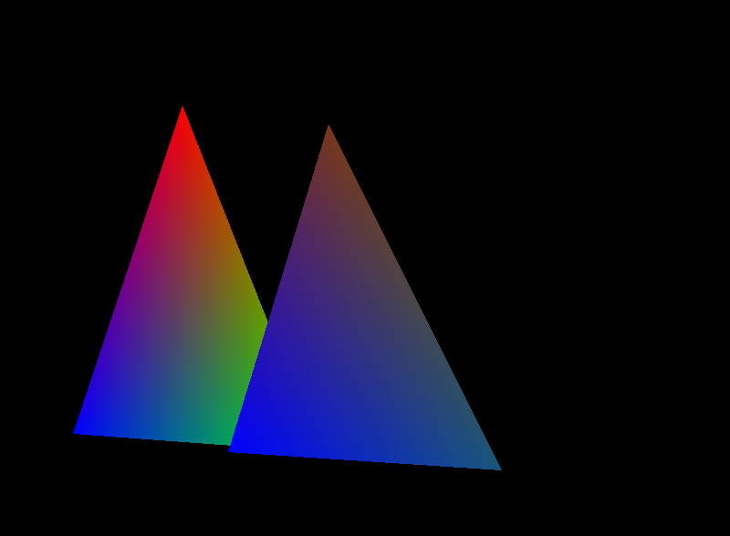

# 🧱 Basic Software Rasterizer (Raylib)

A **CPU-based software rasterizer** built from scratch using **C++ and Raylib**, designed to deeply understand how modern GPUs render triangles.

This project demonstrates both a **naive rasterization approach** and an **optimized edge-function pipeline**, with a real-time toggle to compare performance.

---

## 🚀 Features

- 🧮 Triangle Rasterization (CPU)
- 🎯 Barycentric Coordinates
- 🎨 Per-vertex Color Interpolation
- 📐 Top-Left Fill Rule (GPU-accurate)
- 🔍 Subpixel Precision (pixel center sampling)
- ⚡ Optimized Edge Function Rasterization
- 🐢 Naive Rasterizer (for comparison)
- 📊 Real-time FPS Display
- 🎛️ ImGui UI Toggle (Naive vs Optimized)

---

## 🧠 What This Project Teaches

- Edge functions (signed area)
- Triangle coverage testing
- Barycentric interpolation
- Fill rules used in real GPUs
- Performance optimization techniques

---

## 🆚 Naive vs Optimized

### ❌ Naive
Recomputes edge function for every pixel (slow)

### ✅ Optimized
Uses incremental updates (fast, GPU-like)

---

## 🛠️ Tech Stack

- C++20
- Raylib
- ImGui + rlImGui
- CMake + vcpkg

---

## 📸 Demo Video

<a href="https://youtu.be/LNaD5f8miPQ" target="_blank">
  
</a>

<p>▶ Press (Ctrl + Click) to watch the demo in a new window</p>

---

## 📦 Build Instructions

```bash
git clone https://github.com/jookarim/Basic_Software_Rasterizer_Raylib.git
cd Basic_Software_Rasterizer_Raylib
```

```bash
vcpkg install raylib glfw3
```

```bash
cmake -B build -S . -DCMAKE_TOOLCHAIN_FILE=[path_to_vcpkg]/scripts/buildsystems/vcpkg.cmake
cmake --build build
```

---

## 🎯 Why This Project Matters

Understanding software rasterization builds deep knowledge of how GPUs actually render graphics.

---

## 👨‍💻 Author

Joo – Graphics Programming Student
